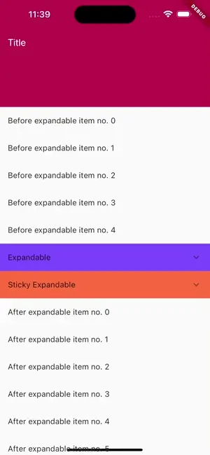

# Sliver Expandable

Sliver Expandable lets expand and collapse any Sliver in Flutter.



## Getting started

1. Add it to your `pubspec.yaml`:

```yaml
sliver_expandable: ^0.0.1
```

2. Use it:

```dart
AnimatedSliverExpandable(
  headerBuilder: (context, animation, onToggle) => ListTile(
    onTap: onToggle,
    tileColor: Colors.amber,
    title: const Text('Expandable'),
    trailing: AnimatedBuilder(
      animation: animation,
      builder: (context, child) => Transform.rotate(
        angle: (animation.value - 0.5) * pi,
        child: child,
      ),
      child: const Icon(Icons.chevron_left),
    ),
  ),
  sliver: SliverList(
    delegate: SliverChildBuilderDelegate(
      (context, index) => ListTile(
        title: Text('Expandable item no. $index'),
      ),
      childCount: 5,
    ),
  ),
),
```